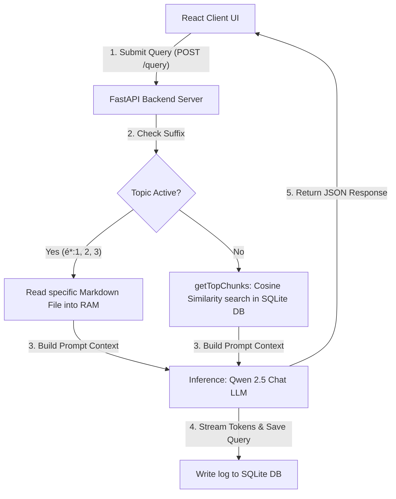

# Foundry Local RAG

**Microsoft AI Summer School 2026**  
*Fully offline Retrieval-Augmented Generation (RAG) assistant running local Qwen embedding and chat completion models via the Foundry Local SDK.*

---

## Tech Stack


---

## Key Features

> [!IMPORTANT]  
> **100% Offline Inference**  
> Runs `qwen3-embedding-0.6b` and `qwen2.5-0.5b` models locally. No data leaves the device.

*   **Dynamic Topic Toggles:** Sidebar options load specialized manuals (Vehicle Fixing, Water & Fire, Wilderness Survival) directly into RAM, keeping the vector database unpolluted.
*   **Automatic Memory Cleanup:** Context guides are automatically flushed from RAM after response generation.
*   **Academic Citations:** Automatically appends bibliographic metadata to topic responses.
*   **macOS Tahoe Theme UI:** Dual-pane desktop-style chat with dark/light mode detection.

---

## System Architecture



---

## 📂 Project Directory Structure

```text
Foundry-Local-Rag/
├── main.py                      # FastAPI server & RAG logic (Qwen embedding/chat, SQLite vector search)
├── database-rag.db              # SQLite database for pre-computed vector embeddings & query logs
├── vehicle_fixing_guide.md      # Vehicle Maintenance Manual (Topic 1: é*:1)
├── water_and_fire_guide.md      # Water Procurement & Firecraft Manual (Topic 2: é*:2)
├── wilderness_survival_guide.md # Wilderness Survival Manual (Topic 3: é*:3)
├── presentation.html            # 6-Slide Interactive Presentation (Light Theme)
├── presentation.pdf             # Exported 16:9 PDF Presentation
├── generate_pdf.js              # Puppeteer script for PDF generation
├── sqlite_basics.py             # SQLite helper & database seeding script
└── frontend/                    # React frontend application (Vite)
    ├── src/
    │   ├── App.jsx              # macOS Tahoe chat UI & topic toggle logic
    │   ├── App.css              # Glassmorphism, traffic light controls & custom styling
    │   └── main.jsx             # React entry point
    ├── index.html               # HTML container
    └── package.json             # Frontend dependencies & scripts
```

---

## Setup & Installation

### Prerequisites

| Tool | Version | Purpose |
| :--- | :--- | :--- |
| **Node.js** | `v18+` | Frontend dev server |
| **Python** | `v3.9+` | FastAPI server and local inference |

### Quick Start

1. **Backend Setup** (Root Directory)
   ```bash
   pip install fastapi uvicorn foundry-local-sdk pypdf pydantic
   python3 main.py
   ```
   *Backend starts at `http://127.0.0.1:8000`. Swagger docs at `/docs`.*

2. **Frontend Setup** (`/frontend` Directory)
   ```bash
   cd frontend
   npm install
   npm run dev
   ```
   *Frontend starts at `http://localhost:5173`.*

---

## References

*   **Survival Content:** Adapted from *U.S. Army Survival Manual FM 3-05.70 / FM 21-76*.
*   **Vehicle Maintenance:** Adapted from *Utah State University Extension, Dept. of Automotive Technology*.
*   **Water and Fire Content:** Adapted from *U.S. Army Survival Manual FM 3-05.70 / FM 21-76*.
*   [FastAPI Documentation](https://fastapi.tiangolo.com) | [React Reference](https://react.dev)
